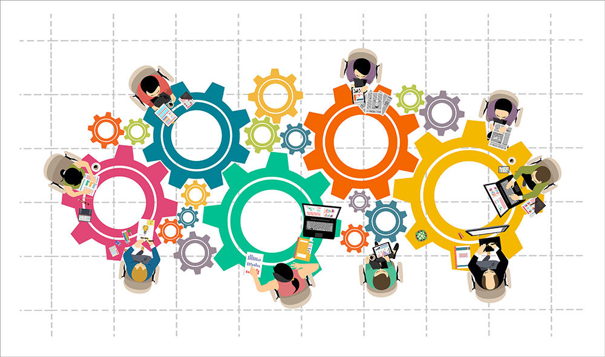

# Data Science
Data Science professional with a strong analytical mindset and proven expertise in leveraging machine learning models to drive business insights and optimize operations. Experienced in collaborating with cross-functional teams to deliver data-driven solutions on time and within budget. Adept at using data analytics to assess and meet operational needs, with a deep understanding of business analytics and systems. Customer-focused and adaptable, thriving in dynamic environments with a high tolerance for risk and tight deadlines

## Education
- B.S., MIS | San Jose State University (_May 2005_)
- A.S., CIT | Evergreen Valley College (_May 2004_)

## Work Experience
TOSHIBA, SAN JOSE, CA						                   Apr. 2022 – Present
#### Senior Specialist - Materials

- Coordinate freight movement from factories to vendor managed inventory (VMI) hubs and distribution centers, ensuring 99.95% on-time delivery
- Coach team members to provide accurate inventory count for hard disk drives (HDD) throughout North America and Mexico, resulting in zero inventory-related discrepancies
- Manage all transportation service providers for inland and inbound product movements, including third-party logistics locations, dispatching carriers, and forwarders; improved cross-border relationships 
- Monitor the service performance of providers, improving the accuracy and timeliness of deliveries, invoicing, tracking information, and loss and damage claims, to 98% vs. 93% in the prior year
- Collaborate cross-functionally to provide analysis & metrics reporting for quarterly business reviews with key logistics providers, facilitating the enterprise planning process

## Projects

#### MKTG 3000 (Marketing is Everything)

This project was to help a start-up company (Star Learning) market its product in two market segments: after school learning centers and instructional small businesses. The challenge was that the company needed to understand the target market and its competitors. For instance, Star Learning needed to understand its customers, context, company, collaborators, and competition to effectively market its product in these markets.

- Created a marketing plan for a start-up company to market its product, utilizing the Marketing Framework to ensure that the plan is focused and impactful
- Analyzed target markets, market trends, and constraints, providing a complete picture of current market and competitors
- Developed a value proposition, which helped the company communicate its product value to customers, for Star Learning
- Performed SWOT analysis and provided a complete picture of the 5Cs (Customers, Context, Company, Collaborators, and Competition) and the 4 Ps (Product, Price, Promotion, and Place) to executives
- Developed success metrics for the company’s product, delivering what success looks like as the end goal

#### MSIS 2402 (Math for Finance and Analytics with R)

The project in MSIS 2402 was to optimize Tesla's call center by minimizing the cost to run the call center using R. For example, I defined the objective function, decision variables, and business constraints that Tesla was facing. I then entered these parameters into R to find the lowest cost to run the call center, helping Tesla answer key questions such as how many English-speaking and Spanish-speaking agents should the company staff its call center while meeting all business constraints such as hours of operations.

- Analyzed Tesla's business problems in staffing its call center to provide software support for its Model E1
- Defined the objective function, decision variables, and business constraints in the Tesla case study and code them in R
- Provided valuable insights to business problems that Tesla was facing with results generated in R, minimizing the company costs while maintaining a fully staffed call center
- Strategically staffed Telsa's call center, meeting all business constraints defined in the business case

#### IDIS 3802 (Data Science with Python)

The project in IDIS 3802 (Data Science with Python) was to analyze the U.S. Food Import dataset. U.S. consumers demand variety, quality, and convenience in the foods they consume. As Americans have become wealthier and more ethnically diverse, the American food basket reflects a growing share of tropical products, spices, and imported gourmet products. Seasonal and climatic factors drive U.S. imports of popular types of fruits and vegetables and tropical products, such as cocoa and coffee. In addition, a growing share of U.S. imports can be attributed to intra-industry trade, whereby agricultural-processing industries based in the United States carry out certain processing steps offshore and import products at different levels of processing from their subsidiaries in foreign markets.

This dataset provides import values of edible products (food and beverages) entering U.S. ports and their origin of shipment. Data are from the U.S. Department of Commerce, U.S. Census Bureau. Food and beverage import values are compiled by calendar year into food groups corresponding to major commodities or level of processing. At least 10 years of annual data are included, enabling users to track long-term growth patterns.

- Analyzed and leveraged data from the U.S. Department of Agriculture to drive insights and inform strategic decision-making
- Optimized data quality and accuracy by cleaning and preparing U.S. Food Import datasets using Python
- Generated actionable business insights by expertly wrangling data, creating visualizations, and applying advanced classification and regression techniques
- Strategically partitioned data into training and testing sets to enhance machine learning (ML) model performance and validation
- Selected and trained optimal machine learning models to accurately predict outcomes and drive data-driven decision-making

